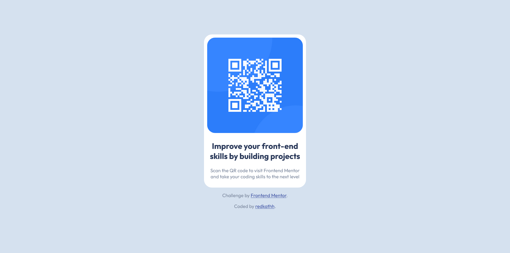

# Frontend Mentor - QR code component solution

This is a solution to the [QR code component challenge on Frontend Mentor](https://www.frontendmentor.io/challenges/qr-code-component-iux_sIO_H). Frontend Mentor challenges help you improve your coding skills by building realistic projects. 

## Table of contents

- [Overview](#overview)
  - [Screenshot](#screenshot)
  - [Links](#links)
- [My process](#my-process)
  - [Built with](#built-with)
  - [What I learned](#what-i-learned)
- [Author](#author)


## Overview
This is my first-ever frontend mentor challenge. This is a qrcode component made with CSS and HTML.
### Screenshot



### Links

- Solution URL: [QR Code Component by Redkath](https://www.frontendmentor.io/solutions/qr-code-component-Qp3pss-PYb)
- Live Site URL: [QR Code Component Live](https://symphonious-torte-921042.netlify.app/)

## My process

### Built with

- 
- 
- 

### What I learned

I struggled trying to center everything because I'm new to HTML and CSS but everything worked out thanks to 
```css 
flex
```
At first all the elements were side-by-side even I was centering everything. It got me so frustrated lol. I used 
```css 
flex-direction: column
``` 
and it worked out well. Centering the component itself was a struggle for me as well. At first the qr-code is at the top of the page and I kept on putting center, all center styles I know but in the end all I need was to give it a padding. This front end mentor challenge is super beginner friendly. But a little bit of working CSS and HTML really helps.

## Author

- Frontend Mentor - [@redKath](https://www.frontendmentor.io/profile/redKath)
- Twitter - [@redkathh](https://www.twitter.com/redkathh)
